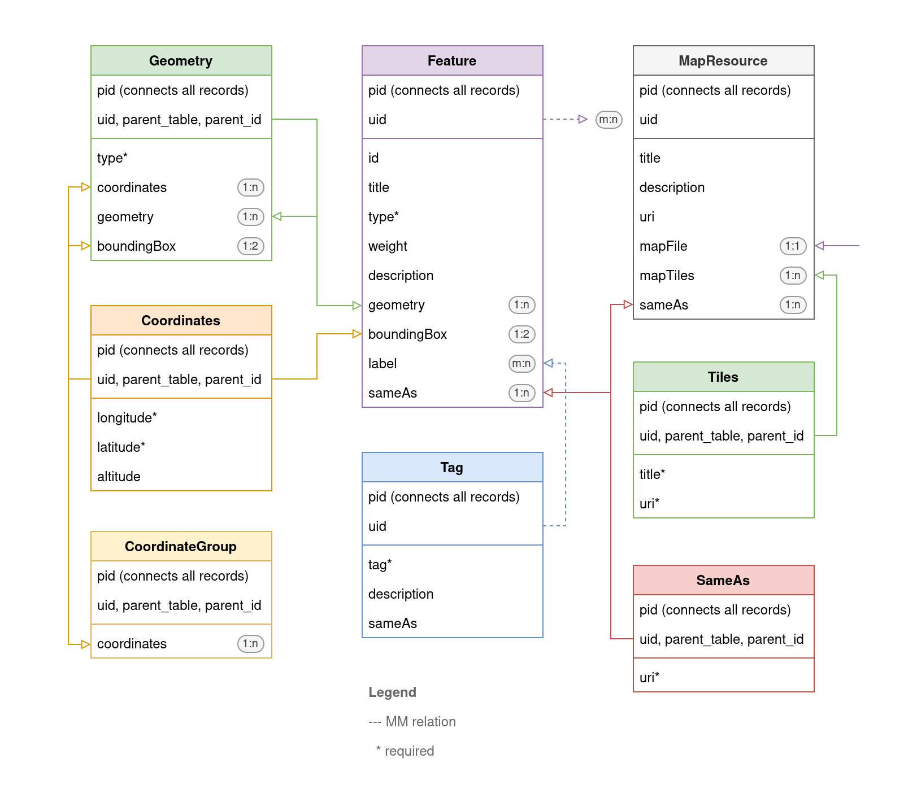

# DA Map

- Description: Provide mapping for research data in TYPO3
- Author: Jonatan Jalle Steller ([jonatan.steller@adwmainz.de](mailto:jonatan.steller@adwmainz.de))
- Requirements: TYPO3 12
- License: GPL 3
- Version: 0.0.2

This TYPO3 extension implements a data model inpspired by [GeoJSON](https://datatracker.ietf.org/doc/html/rfc7946). All geographical features can be serialised as valid GeoJSON. The extension also acts as a wrapper for [Leaflet](https://leafletjs.com/) and provides a plugin to show individual our groups of features as content elements in the frontend. Integrators may specify the map tiles or the image file to display using Leaflet.

## Setup

1. Install the extension.
2. Add a `MapResource` to a data folder where you want to store data belonging to the same map.

If you need to set up multiple map resources, simply set up multiple data folders and add a `MapResource` to each of them.

## Usage

TBD

## Development

TBD

## Data model

All records of a single `MapResource` are held together by using the same page ID (PID). Each `MapResource` may either specify a number of `Tiles` it wants to map its data onto or an image file that it is projected upon. The core class `Feature` may have the types "Feature" or "Feature collection". A feature or collection of features has a a dependent class that provides recurring types of information: `Geometry` can have various types ("Point", "Line string", "Polygon", "Multi points", "Multi line strings", "Multi polygons", "Geometry collection") and contains lists of either `Coordinates` or `CoordinateGroup`s. In addition, the model knows flexible `Tag`s and `SameAs` classes, which can be used to group features via labels and to connect entities to Linked Open Data.

## Roadmap

**Version 0.7.0**

- TCA and model work as expected
- Working frontend plugin

**Version 0.8.0**

- Import of DFD data
- Serialisation(s) of DFD data
- Consider adding a generic search config

**Version 0.9.0**

- Make import generic
- Make serialisation(s) generic

**Version 1.0.0**

- Add testing
- Finish documentation
